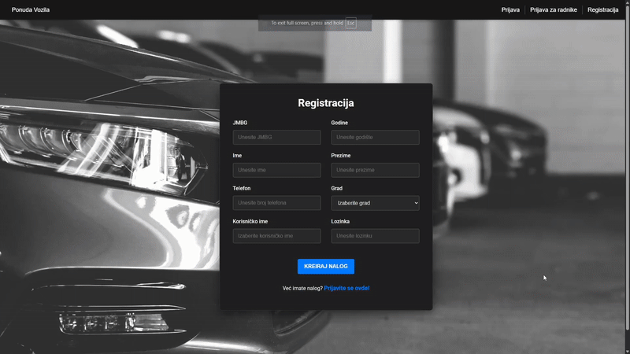

# Rent-a-Car Management System

This is a full-stack Rent-a-Car application consisting of a **Spring Boot backend** and an **Angular frontend**.  
The system enables administrators and staff to manage cars, clients, rentals, cities, car models, and users.  
It includes authentication, CRUD operations, and a modern UI.

## Features

### Cars
- Add, edit, delete cars
- Manage availability (available / rented)
- Filter by category
- Car model CRUD
- City CRUD (pick-up locations)

### Clients
- Register clients
- Edit client information
- Client search
- Client delete

### Rentals
- Create a rental
- Assign car + client
- Rental list for admin
- Rental modification
- Automatic car availability update
- Rental cancellation logic

### Authentication
- User login
- Client login
- Register new users or clients
- Route protection

## Project Structure

- /frontend --> Angular application
- /backend --> Spring Boot REST API
- /docs --> Documentation (optional)
- /images --> Screenshots

## Technologies

### Frontend
- Angular
- TypeScript
- HTML & CSS
- Angular Router
- RxJS

### Backend
- Spring Boot
- JPA / Hibernate
- MySQL or MariaDB
- DTO mapping
- REST API

## How to Run

### Backend
```bash
cd backend
mvn spring-boot:run
```

### Frontend
```bash
cd frontend
npm install
npm start
```

Access the UI at:
```arduino
http://localhost:4200
```

Backend runs at:
```arduino
http://localhost:8080
```



[Download Video Demo](demo/micko_diplomski.mp4)
## Documentation
[Download Documentation](docs/ProjektnaDokumentacija.pdf)

## Author

Dimitrije Mitić
Faculty of Organizational Sciences (FON)
